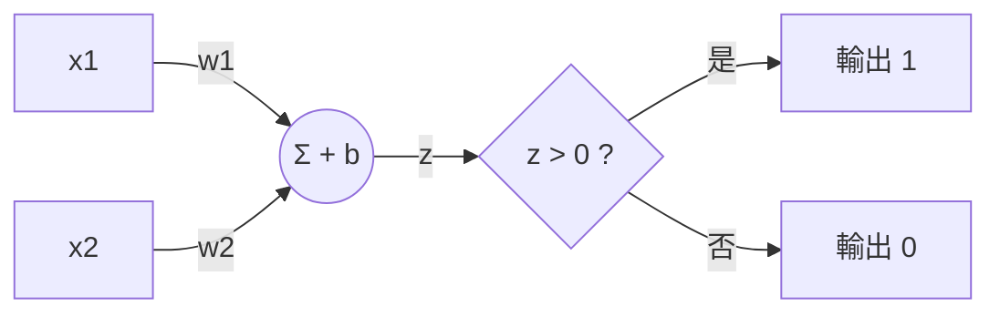
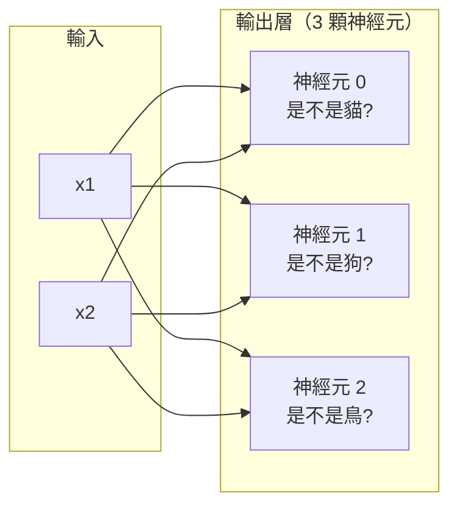
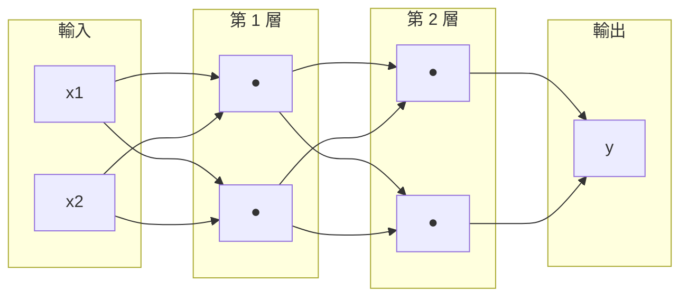
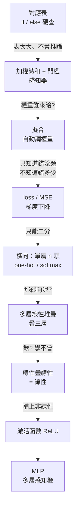

## 寫在前面...<sub> 我就不想叫前言 你管我<sub>
AI時代其實你完全能利用AI來幫助你學習 若是在教學中遇到不懂之處

可以嘗試使用AI詢問 

~~整個教學又能稱為'AI從入門到被AI取代'~~

這篇不會有一堆嚇死人的數學符號突然砸在你臉上。
我們會一步步來經歷並實作AI的發展。

**你需要先會的東西：** 你至少得要會基礎以上的python能力、NumPy基礎能力、一點數學<sub> ~~或很多的數學~~<sub>。

---

## 從一個簡單的問題出發

先不要想 AI。我給你一張表：

| 編號 | 分數 $x$ | 答案 $y$ |
|:---:|:---:|:---:|
| 0 | 0 | 1 |
| 1 | 100 | 0 |
| 2 | 79 | 0 |
| 3 | 64 | 1 |
| 4 | 87 | 0 |
| 5 | 55 | 1 |
| 6 | 43 | 1 |

現在我問你：**80的答案是多少？**

如標題所說這很簡單，你腦袋瞬間就能找出規律解出答案。

而如果我們要使用程式解題，那麼我們就只需要把我們找到的規律寫上就能完成。

---

## 第一顆神經元

你大概三秒就看出來了：**70 分以下是 1，70 分以上是 0**。所以 80 的答案是 `0`。

把這條規律寫成程式：

```python
def need_makeup(x):
    if x < 70:
        return 1
    else:
        return 0

for x in [0, 100, 79, 64, 87, 55, 43]:
    print(f"{x:5d} -> {need_makeup(x)}")

print("80 ->", need_makeup(80))
```

```
    0 -> 1
  100 -> 0
   79 -> 0
   64 -> 1
   87 -> 0
   55 -> 1
   43 -> 1
80 -> 0
```

恭喜，你剛剛寫出了一顆AI最基礎的**神經元**。

蛤？

沒錯。如果把 AI 最早的型態抽象成「規則判斷」，那 `if/else` 就是最簡單的雛形。

先講清楚免得誤會：**這不是說只要有條件判斷就算 AI**。而是說，最原始的那顆神經元，
拆開來看就長這個樣子。

我沒有在唬爛。回頭看看這個程式在幹嘛：

1. 它**接收一個輸入**（分數 `x`）
2. 它**拿這個輸入去跟一個門檻比大小**（`x < 70`）
3. 它**吐出一個結果**（1 或 0）

生物課本上那顆神經細胞，把細節全部抽掉之後，做的也是這三步：

**收到訊號 → 把訊號加總起來 → 超過某個強度就發射，不到就安靜。**

你的 `if` 就是這個流程最陽春的版本。所以它確實是一顆神經元，只是廢了一點。

廢在哪？剛好三個地方，而這三點就是這篇文章接下來要一個一個補起來的：

- **門檻是我寫死的**——那個 `70` 是我用眼睛看表看出來的，不是程式算出來的
- **它只吃一個輸入**——真實問題不會只給你一個數字
- **它不會變**——換一張表，它還是講一模一樣的話

先把這三點記著。等一下每解決掉一個，它就會更像一顆真正的神經元。


---

## 然後呢？

現在問題出現了。

**如果規律變了呢?**
| 編號 | 分數 $x$ | 答案 $y$ |
|:---:|:---:|:---:|
| 0 | 0 | 0 |
| 1 | 100 | 1 |
| 2 | 79 | 1 |
| 3 | 64 | 1 |
| 4 | 87 | 1 |
| 5 | 55 | 0 |
| 6 | 43 | 0 |

很顯然剛才的程式瞬間變成錯誤，我們要的AI可不是這樣的。

**而且規律是誰找到的?**
規律不是程式自己找到的，而是你先看出來再寫進去的。

**你的程式能做到哪些事?**
所以它不是在學，只是在照抄。

**這就是死背和理解的差別。** 你的 `if` 是在死背，它完全沒有「懂」這張表。

所以真正的問題變成了：

> 有沒有辦法讓程式**找到一條規則**，而不是把整張表背下來？

---
## 找規則，不要背答案

先把話講清楚：剛剛那個 `if x < 70`，**程式從頭到尾什麼都沒找到。**

那個 `70` 是我看表看出來的，那個 `<` 也是我決定的。我只是把我腦袋裡已經算好的答案抄進程式碼而已。
規律寫死在程式碼裡，所以規律一變，就得回去改程式碼——這就是它剛剛陣亡的原因。

那，能不能把規律從程式碼裡**搬出來**？

先看看這兩張表到底差在哪：

- 表一：**低**於 70 → 1
- 表二：**高**於 60 → 1

差別只有兩件事：**門檻**不一樣（70 vs 60），還有**方向**相反（低於 vs 高於）。

如果我能用「數字」把這兩件事表示出來，那程式碼就一個字都不用改了。試試看這個寫法：

$$
z = w \cdot x + b \qquad z > 0 \text{ 就輸出 } 1
$$

- $b$ 負責**門檻**
- $w$ 的**正負號**負責**方向**：$w$ 是正的代表「越大越容易輸出 1」，$w$ 是負的代表「越小越容易輸出 1」

代進去算算看：

- 表一要「低於 70 → 1」：取 $w=-1,\ b=70$，得 $z = -x + 70 > 0$，也就是 $x < 70$ ✓
- 表二要「高於 60 → 1」：取 $w=1,\ b=-60$，得 $z = x - 60 > 0$，也就是 $x > 60$ ✓

```python
def neuron(x, w, b):
    z = w * x + b
    return 1 if z > 0 else 0

scores = [0, 100, 79, 64, 87, 55, 43]

print("分數               ", scores)
print("表一 (w=-1, b=70)  ", [neuron(x, -1, 70) for x in scores])
print("表二 (w=+1, b=-60) ", [neuron(x, 1, -60) for x in scores])
print()
print("80 分 -> 表一:", neuron(80, -1, 70), " 表二:", neuron(80, 1, -60))
```

```
分數                [0, 100, 79, 64, 87, 55, 43]
表一 (w=-1, b=70)   [1, 0, 0, 1, 0, 1, 1]
表二 (w=+1, b=-60)  [0, 1, 1, 1, 1, 0, 0]

80 分 -> 表一: 0  表二: 1
```

**同一個 `neuron` 函式，一個字都沒改，兩張表都對了。**

我要特別強調：**這裡的程式還是不會「推論」**，$w$ 和 $b$ 一樣是我自己算好填進去的。
如果你以為到這裡就有 AI 了，那是被騙了。

但有一件事**真的**變了——規律本來寫在**程式碼**裡，現在被搬到**兩個數字**裡了。

差在哪？程式碼沒辦法自動生出來，但數字可以。數字可以亂猜、可以一點一點調、可以用算的。

我們剛剛把一個「要動腦寫程式」的問題，換成了一個「**要找兩個數字**」的問題。

這個轉變是整篇文章最重要的一句話，我再說一次：

> 我們不是要程式記住答案，是要它能夠找到並學會如何找到那條產生答案的規律。

---

## 感知器

剛剛那條 $z = wx + b$ 只吃**一個**分數。但真實的問題不會這麼客氣。

假設現在及不及格要看**兩科**：期中 $x_1$ 和期末 $x_2$。

而且這兩科**不一樣重**——老師說期末比較重要。

「比較重要」要怎麼變成數字？很直接，**乘上去的那個數字大一點，就是比較重要**：

期中乘 0.4、期末乘 0.6，加起來就是這個人的加權總分。誰的比重大，誰對結果的影響就大。

這個「乘上去的數字」就叫**權重（weight）**。

所以把剛剛那條式子從一個輸入擴充到兩個，就長這樣：

$$
z = w_1 x_1 + w_2 x_2 + b
$$

$$
y = \begin{cases} 1 & \text{if } z > 0 \\ 0 & \text{if } z \le 0 \end{cases}
$$

- $w$（weight，權重）：這個輸入有多重要。**大小**決定份量，**正負號**決定方向（正的：越大越傾向輸出 1；負的：越大越傾向輸出 0）。
- $b$（bias，偏置）：門檻。就是剛剛表一的 $b=70$、表二的 $b=-60$ 那個角色。
- $z$：加權總和，可以直接想成**這個人的總分**。
- 最後那個「$z > 0$ 就輸出 1」：這叫**階梯函數（step function）**，它負責把 $z$ 這個連續的分數，壓成一個乾脆的 0 或 1。

最後那一項要特別記住：**它就是最早期的「激活函數（activation function）」**。

「激活函數」聽起來很唬人，但它指的就是**接在加權總和後面、決定這顆神經元要不要發射的那個函數**。
階梯函數是它最古老的長相。等一下你會看到，為了讓多層網路能訓練，我們會把它換成別的長相——
但位置永遠是同一個位置。先把這個位置記著，它會變成整篇文章的轉捩點。

這東西就叫**感知器（Perceptron）**，1958 年的產物，是所有神經網路的祖宗。



寫成程式。順便用它來看看「權重」到底有什麼用：

```python
def perceptron(x, w, b):
    z = sum(xi * wi for xi, wi in zip(x, w)) + b
    return 1 if z > 0 else 0

students = [("小明", [80, 40]),     # 期中高、期末低
            ("小華", [40, 80])]     # 期中低、期末高

rules = [("期末算重一點 (4:6)", [0.4, 0.6], -60),
         ("期中算重一點 (6:4)", [0.6, 0.4], -60)]

for rule_name, w, b in rules:
    out = "  ".join(f"{name}={perceptron(x, w, b)}" for name, x in students)
    print(f"{rule_name} -> {out}")
```

```
期末算重一點 (4:6) -> 小明=0  小華=1
期中算重一點 (6:4) -> 小明=1  小華=0
```

停下來看一下這個結果。

小明和小華的**平均分數一模一樣，都是 60 分**。但誰及格、誰被當，**完全取決於權重怎麼設**。

同一個函式、同一批學生，程式碼一行都沒改，改的只有那幾個數字。
也就是說——「這顆神經元要做什麼」這件事，已經完全從**程式碼**裡搬到**數字**裡了。

而數字，是可以用算的。

---

## 那權重誰來決定？「擬合」

上面的 4:6、6:4 是我自己訂的。但真實情況是——**你根本不知道該用幾比幾。**

你手上通常只有一疊紀錄：這個學生幾分幾分、最後過了還是沒過。
至於老師心裡那把尺到底怎麼量的，沒有人會告訴你。

所以下一個問題：**能不能讓程式自己從這疊紀錄裡，把權重挖出來？**

解法非常暴力：

1. **亂猜**一組權重
2. 拿題目去問它，看它**錯多少**
3. 往「錯比較少」的方向**調一點點**
4. 回到第 2 步，重複幾百次

這個「一直微調到貼合資料」的過程，就叫**擬合（fitting）**。

第 3 步怎麼調？感知器有個超簡單的規則：

$$
w \leftarrow w + \eta \cdot (\text{正確答案} - \text{它的答案}) \cdot x
$$

$\eta$ 唸作 eta，指的是**學習率**，就是「每次調多大步」。
看起來像數學，但這條式子其實只有**三種情況**：

| 這題的狀況 | 括號 $(\text{正確答案}-\text{它的答案})$ | 會發生什麼 |
|:---|:---:|:---|
| 它猜對了 | $0$ | 整條式子乘 0，**權重完全不動** <sub>雖然實際在訓練時你幾乎不可能遇到這種狀況<sub>|
| 該及格，它卻說不及格 | $+1$ | 權重**往上加**，讓下次算出來的 $z$ 大一點 |
| 該不及格，它卻說及格 | $-1$ | 權重**往下減**，讓下次算出來的 $z$ 小一點 |

換句話說：**猜對就別動它，猜錯就往「剛才應該要走的方向」推一小步。**

那**為什麼還要再乘上 $x$**？

回頭看 $z = w_1x_1 + w_2x_2 + b$。假設某個學生期中考 0 分，
那 $w_1$ 在這次判斷裡根本沒出到力（$w_1 \times 0 = 0$），這題判錯了當然不能算在它頭上，
所以 $w_1$ 這次不該被改。

反過來，某科分數越高，它在這次判斷裡「出力」越多，要負的責任就越大，該調的幅度也越大。

**誰有份，誰負責。**

那 $b$ 呢？它的更新式長這樣，注意**後面沒有乘 $x$**：

$$
b \leftarrow b + \eta \cdot (\text{正確答案} - \text{它的答案})
$$

為什麼 $b$ 不用乘？有個很好用的看法：**把 $b$ 想成一個「永遠等於 1 的輸入」的權重。**

$$
z = w_1x_1 + w_2x_2 + b \cdot 1
$$

既然那個輸入永遠是 1，它每次都出一樣的力，那把 $x$ 換成 1 代進上面那條式子，
$\eta \cdot (\ldots) \cdot 1$ 就是 $\eta \cdot (\ldots)$——一模一樣，只是省略了乘 1。

這個「**bias 就是常數輸入的權重**」的觀點先記著，之後講 CNN、Transformer 還會再用到。

### 順帶一提：為什麼要把分數除以 100

接下來程式裡有一行 `X = raw / 100.0`，這不是隨手做的。

看更新式 `w += lr * err * x`：$x$ 是原始分數的話可以到 **100**，
`lr` 是 0.1，所以錯一題權重就直接跳動 10——整個權重直接飛出去，下一輪錯更多。

縮到 0~1 之後，單次調整最多是 $0.1 \times 1 = 0.1$，幅度才受控。

（我實際測過：不做這件事，這份資料**不會收斂**，會一直卡在 20 幾題錯。還不給偷懶了qwo）

```python
import numpy as np

rng = np.random.default_rng(0)

# 60 筆學生紀錄：[期中, 期末]
raw = rng.integers(0, 101, size=(60, 2)).astype(float)

# 真正的規則（程式看不到，只有出題的我們知道）：期中 4 成 + 期末 6 成，滿 60 就及格
weighted = 0.4 * raw[:, 0] + 0.6 * raw[:, 1]
keep = np.abs(weighted - 60) > 3          # 把剛好卡在及格線上的邊緣個案拿掉
raw, weighted = raw[keep], weighted[keep]
Y = (weighted >= 60).astype(float)

X = raw / 100.0                            # 分數縮到 0~1（原因見下方說明）

w = rng.normal(0, 0.1, size=2)             # 亂猜
b = 0.0
lr = 0.1

print(f"資料共 {len(Y)} 筆，及格 {int(Y.sum())} 人")
print("一開始亂猜的：w =", np.round(w, 3), " b =", b)

for epoch in range(50):
    wrong = 0
    for x, target in zip(X, Y):
        pred = 1.0 if np.dot(w, x) + b > 0 else 0.0
        err = target - pred
        if err != 0:
            wrong += 1
            w += lr * err * x
            b += lr * err
    print(f"第 {epoch} 輪：錯 {wrong} 題  w = {np.round(w,3)}  b = {round(b,3)}")
    if wrong == 0:
        break

print("學到的：w =", np.round(w, 3), " b =", round(b, 3))
print("它認為 期末:期中 的比重 =", round(w[1]/w[0], 2), " （真正的規則是 0.6:0.4 = 1.5）")
```

```
資料共 54 筆，及格 20 人
一開始亂猜的：w = [-0.044 -0.117]  b = 0.0
第 0 輪：錯 15 題  w = [0.026 0.175]  b = -0.1
第 1 輪：錯 11 題  w = [0.117 0.259]  b = -0.2
第 2 輪：錯 9 題  w = [0.168 0.313]  b = -0.3
第 3 輪：錯 0 題  w = [0.168 0.313]  b = -0.3
學到的：w = [0.168 0.313]  b = -0.3
它認為 期末:期中 的比重 = 1.86  （真正的規則是 0.6:0.4 = 1.5）
```

四輪，錯誤從 15 題掉到 0 題。

**我沒有告訴它任何權重，它自己從 54 筆紀錄裡爬出了 `w = [0.168, 0.313]`。**

注意一下：它找到的比重是 **1 : 1.86**，而我出題時用的是 `0.4 : 0.6`，也就是 1 : 1.5。
**比例不一樣，但它一題都沒錯。**

為什麼？因為能把這批資料分乾淨的線**不只一條**。感知器只要找到其中一條就會停下來，
它的目標是「不出錯」，不是「找到最漂亮的那條」。

**這個狀況等一下就會出事。** 先記著，我們馬上回來修理它。

那它到底是背起來還是真的學會了？拿它沒看過的學生去問：

```python
for name, mid, fin in [("小明", 80, 40), ("小華", 40, 80), ("阿美", 95, 95), ("阿呆", 20, 30)]:
    x = np.array([mid, fin]) / 100.0
    pred = 1 if np.dot(w, x) + b > 0 else 0
    truth = 1 if 0.4*mid + 0.6*fin >= 60 else 0
    print(f"{name} 期中{mid:3d} 期末{fin:3d} -> 它說 {pred}，正確答案 {truth}  {'OK' if pred==truth else 'X'}")
```

```
小明 期中 80 期末 40 -> 它說 0，正確答案 0  OK
小華 期中 40 期末 80 -> 它說 1，正確答案 1  OK
阿美 期中 95 期末 95 -> 它說 1，正確答案 1  OK
阿呆 期中 20 期末 30 -> 它說 0，正確答案 0  OK
```

**這次才是真的「找到規律」。**

跟前面 `if x < 70` 對比一下：那次是我把答案抄進程式碼；
這次我從頭到尾沒講過 60、沒講過 4:6，只丟給它一疊「誰過誰沒過」的紀錄，
權重是它自己一輪一輪調出來的。

這就是「**訓練**」跟「**寫死**」的差別。

### 那條線長什麼樣子

$z = w_1x_1 + w_2x_2 + b$，而分界點在 $z = 0$。
把 $z=0$ 攤開來看，它就是一條**直線**（國中的 $ax+by+c=0$）。

把每個學生畫成平面上的一個點（橫軸期中、縱軸期末），及格的塗一種顏色、不及格塗另一種，
那麼感知器在做的事就是：**在這張圖上畫一條線，線的一邊喊及格，另一邊喊不及格。**
訓練的過程，就是這條線一直挪、一直轉，挪到把兩種點分乾淨為止。


看懂這張圖，你就懂「擬合」了：**就是挪那條線，挪到它貼合資料為止。**  
<sub>別管那MLP，我懶得寫另一個模型的擬合動畫顯示，當然如果你對此有興趣的話可以去我的GitHub專案看看<sub>

---

## 從「錯幾題」到「錯多少」

現在來修理剛剛那個性格。

回頭看更新規則裡的那個括號：$(\text{正確答案} - \text{它的答案})$。

兩邊都只會是 0 或 1，所以這個括號**永遠只有三種值**：$-1$、$0$、$+1$。

也就是說：**它只知道自己有沒有錯，完全不知道自己錯多遠。**
差一點點和差十萬八千里，在它眼裡是同一件事，罰得一樣重。

### 這會出什麼事

想像兩條線：一條**緊貼著**及格邊緣的學生擦過去，另一條走在兩群人的**正中間**。
兩條都把 54 筆資料分乾淨、都是 0 題錯。

**在感知器眼裡，這兩條線一樣好。** 因為它評分的方式只有一種：數錯幾題。

但你我都看得出來，那條貼邊的線很危險——來一個新學生就可能翻車。

它不是找不到好答案，是**它的評分標準太粗糙，根本分不出好壞**。

### 我們需要一個會打分數的函數

所以真正缺的是：一個能幫**一組權重**打分數的函數。
不是回答「錯幾題」，而是回答「**總共錯得多嚴重**」。

這個東西叫 **loss（損失函數）**：吃進一組權重，吐出一個數字，越小代表這組權重越好。

訓練的目標於是從「把每題弄對」變成「**把 loss 壓到最小**」。

最直覺的做法是把每題的誤差加起來，但直接加會出事：

```python
errors = [+3, -3]     # 一題猜高 3 分，一題猜低 3 分
sum(errors)           # → 0，看起來完美，實際上兩題都錯很大
```

一正一負互相抵銷了。所以要先讓它們**都變成正的**再加。

取絕對值可以，但**平方更好**，理由有三個：

| 理由 | 說明 |
|:---|:---|
| 正負不抵銷 | 平方一定 $\ge 0$，不會互相消掉 |
| 錯越多罰越重 | 差 2 分罰 4，差 10 分罰 100 —— 它會優先去修那些錯得離譜的 |
| **它可微** | 這個最重要，見下面 |

把每題誤差平方、再取平均，就是最常用的那個 loss：

$$
\text{MSE} = \frac{1}{N}\sum_{i=1}^{N} (\hat{y}_i - y_i)^2
$$

MSE = Mean Squared Error，中文叫**均方誤差**。
它等一下會以 `np.mean((out - Y) ** 2)` 這個樣子出現在每一份程式碼裡。

### 為什麼「可微」才是重點

絕對值 $|x|$ 在 0 那裡有個**尖角**，尖角上沒有斜率可言。平方 $x^2$ 則從頭到尾平滑。

這件事直接改變了「往哪調」這個問題的性質：

- **感知器**：只知道對錯 → 只能**猜方向**（猜錯就往反方向推一步）
- **有了連續的 loss**：可以問**斜率** → 斜率會告訴你往哪走 loss 變小，還告訴你該走多大步

**「往哪調」從此變成一個可以「算」出來的問題，而不是靠規則硬湊。**

這就是**梯度下降（gradient descent）**，也就是後面每份程式碼裡那行 `p -= lr * g` 在做的事：
$g$ 是斜率，往斜率的反方向走一小步。  
<sub>昂，沒錯，梯度下降可以說就是微分與斜率。

（現在不用完全懂，等一下手刻的時候你會親眼看到它跑起來。）

---

## 多分類
新的問題出現了，
如果只能切一刀，那要分很多類怎麼辦？


一顆感知器只會吐 0 或 1，也就是只能回答「是」或「不是」。這叫**二分類**。

可是我想做的是辨識手寫數字，有 0～9 **十個**類別。
或是分貓、狗、鳥。一刀切下去只有兩邊，怎麼分三種？

停一下，自己想三秒。

.

.

.

想到了嗎？
**那就多放幾顆啊。 ~~AI就是一個暴力美學啊~~**

一顆負責回答「是不是貓？」，一顆負責「是不是狗？」，一顆負責「是不是鳥？」。
三顆神經元，每顆都看同樣的輸入，但各自有各自的權重。



這排最後負責吐答案的神經元，就叫**輸出層（output layer）**。
要分幾類，就放幾顆。要分 10 類就放 10 顆，就這麼樸素。

### 輸出層：n 個數字怎麼變成一個答案

但馬上有兩個很煩的問題。

**最後的輸出結果怎麼表示？**

以前只有一顆神經元，答案就是它吐的那個 0 或 1，很單純。
現在有**三顆**，它們會吐出**三個數字**——所以「標準答案」自然也得是三個數字。

那這三個數字要怎麼寫？照著每顆神經元各自的工作去寫就好：

第 0 顆的工作是回答「是不是貓」。所以看到一隻貓的時候，
第 0 顆的標準答案就是 1，另外兩顆該說「不是」，標準答案是 0。

所以改成這樣寫：

| 類別 | 標準答案 |
|:---|:---|
| 貓 | `[1, 0, 0]` |
| 狗 | `[0, 1, 0]` |
| 鳥 | `[0, 0, 1]` |

「是哪一類，哪一格就是 1，其他都是 0」。這叫 **one-hot 編碼**（只有一個是熱的）。
它完美對應到三顆神經元：第 0 顆該吐 1、其他該吐 0，就代表這是貓。

<sub>（順帶回答一個常見疑問：那把貓狗鳥直接編成 0、1、2 一個數字不行嗎？牠們之間根本沒有順序關係。）</sub>

**三個輸出怎麼合成一個答案？**

假設三顆神經元吐出 `[2.3, 0.5, -1.1]`，那答案是什麼？

**看誰最大就是誰。** 第 0 顆最大 → 答案是貓。這個動作叫 `argmax`（最大值的位置）。

但 `[2.3, 0.5, -1.1]` 這種分數很難解讀。2.3 是很有把握還是普通有把握？跟 `[23, 5, -11]` 差在哪？

問題在於**這些分數沒有共同的尺標**，你只能比大小，沒辦法比「差多少」。

我們想要的不只是分數，而是一組**彼此比較過的相對信心**：
三個數字都落在 0～1 之間，而且加起來剛好是 1。
這樣一看到 `[0.85, 0.10, 0.05]`，就能直接讀成「第一類的把握遠大於另外兩類」。

做法是：先全部取 $e^{z}$（保證變正數，而且拉開差距），再各自除以總和（保證加起來是 1）。

```python
def softmax(z):
    z = z - z.max(axis=1, keepdims=True)   # 防止 exp 爆掉，不影響結果
    e = np.exp(z)
    return e / e.sum(axis=1, keepdims=True)
```

這個轉換叫 **softmax**。名字先放著，你只要記得它在幹嘛：**把各類別的分數正規化成一組可比較的信心值，總和為 1，方便解讀。**

<sub>（嚴格講，softmax 的輸出是「正規化後的分數」，只是因為它滿足「非負、總和為 1」這兩個性質，實務上大家都直接當機率在用、也常被稱為機率分布。先知道有這個分別就好。）具體數學很麻煩你去問AI吧owob</sub>

到這裡，輸出層那一整包就可以綁起來了：

> **有幾類，輸出層就放幾顆神經元**；標準答案用 **one-hot** 寫；
> 訓練時用 **softmax** 把分數轉成可比較的信心值；預測時用 **argmax** 挑出最大的那一格。
>
> 說穿了就是：**哪一類是 1，就代表模型要想辦法把那一格算成最大。**

### 實作：單層 3 顆神經元

三顆神經元，每顆都有自己的 2 個權重加 1 個偏置：

- 貓神經元：權重 $[w_{1,\text{貓}},\ w_{2,\text{貓}}]$，偏置 $b_\text{貓}$
- 狗神經元：權重 $[w_{1,\text{狗}},\ w_{2,\text{狗}}]$，偏置 $b_\text{狗}$
- 鳥神經元：權重 $[w_{1,\text{鳥}},\ w_{2,\text{鳥}}]$，偏置 $b_\text{鳥}$

最直覺的寫法是跑三次迴圈，一顆一顆算。但更好的做法是把它們**並排成一個矩陣**，
規則很簡單：**一顆神經元對應矩陣的一個欄（column）**。

$$
W = \begin{bmatrix} w_{1,\text{貓}} & w_{1,\text{狗}} & w_{1,\text{鳥}} \\ w_{2,\text{貓}} & w_{2,\text{狗}} & w_{2,\text{鳥}} \end{bmatrix}
\qquad
b = [\,b_\text{貓},\ b_\text{狗},\ b_\text{鳥}\,]
$$

這樣排的好處是，一個 `@` 就把三顆神經元同時算完：

```python
import numpy as np

x = np.array([[1.0, 2.0]])         # 一筆資料，2 個特徵

W = np.array([[0.5, -0.2,  0.1],   # 第 1 個特徵 對 貓/狗/鳥 的權重
              [0.3,  0.8, -0.6]])  # 第 2 個特徵 對 貓/狗/鳥 的權重
b = np.array([0.0, 0.1, -0.1])

print(x @ W + b)
```

```
[[ 1.1  1.5 -1.2]]
```

自己驗算第一個數字：$1.0 \times 0.5 + 2.0 \times 0.3 + 0.0 = 1.1$ 
那就是「貓神經元」的加權總和。第二、第三個數字同理，分別是狗和鳥的。

把形狀對一下就更清楚了：

| 東西 | 形狀 | 意思 |
|:---|:---|:---|
| `X` | $(N,\ 2)$ | $N$ 筆資料，每筆 2 個特徵 |
| `W` | $(2,\ 3)$ | 2 個特徵 → 3 顆神經元 |
| `b` | $(3,)$ | 每顆神經元各一個偏置 |
| `X @ W + b` | $(N,\ 3)$ | $N$ 筆資料，每筆得到 3 顆神經元的輸出 |

中間那個 2 會被「消掉」，剩下 $(N, 3)$。

所以矩陣乘法在這裡不用想得太玄，它就只是「**幫你把好幾組加權總和一次算完**」的批次工具而已。
這個形狀的規則之後每一層都會用到，現在先熟悉它。

```python
import numpy as np

rng = np.random.default_rng(42)

# 造三坨資料：貓在上面、狗在左下、鳥在右下
centers = np.array([[0.0, 2.0], [-2.0, -1.0], [2.0, -1.0]])
X, y = [], []
for k, c in enumerate(centers):
    X.append(rng.normal(c, 0.6, size=(40, 2)))
    y += [k] * 40
X = np.vstack(X)
y = np.array(y)

# 標準答案轉成 one-hot
Y = np.zeros((len(y), 3))
Y[np.arange(len(y)), y] = 1  # 第 i 列的第 y[i] 格填 1 —— 兩個陣列配對成 (0,y[0]), (1,y[1]), ... 逐一定位

def softmax(z):
    z = z - z.max(axis=1, keepdims=True)
    e = np.exp(z)
    return e / e.sum(axis=1, keepdims=True)

W = rng.normal(0, 0.1, size=(2, 3))   # 2 個輸入 → 3 顆神經元
b = np.zeros(3)
lr = 0.1

for step in range(301):
    p = softmax(X @ W + b)                          # 前向：算出各類別的信心值
    loss = -np.mean(np.sum(Y * np.log(p + 1e-9), 1))  # 錯多少
    dz = (p - Y) / len(X)                           # 往哪調
    W -= lr * (X.T @ dz)
    b -= lr * dz.sum(axis=0)
    if step % 100 == 0:
        acc = (p.argmax(axis=1) == y).mean()
        print(f"step {step:4d}  loss {loss:.4f}  正確率 {acc:.3f}")

probs = softmax(np.array([[0.0, 2.0]]) @ W + b)
print("點 (0,2) 的信心分布 =", np.round(probs[0], 3), "→ 判定為第", probs[0].argmax(), "類")
```

```
step    0  loss 1.3850  正確率 0.008
step  100  loss 0.0603  正確率 0.992
step  200  loss 0.0381  正確率 0.992
step  300  loss 0.0302  正確率 0.992
點 (0,2) 的信心分布 = [0.988 0.007 0.005] → 判定為第 0 類
```

99.2%，而且它對 `(0, 2)` 這一點給出 0.988 的信心，幾乎把全部的把握都壓在「貓」上。

那個 `dz = (p - Y)` 很值得看一眼：**「它猜的信心值」減掉「正確答案」**，
猜太高就往下壓、猜太低就往上拉，跟前面感知器的 `(target - pred)` 根本是同一個精神。
只是換了個 loss，這個減法自動就跑出來了（這個之後會講）。


---


## 那如果是縱向疊呢？

好，剛剛我們把神經元**橫向**排開，從 1 顆變成 n 顆，解決了多分類。

**橫向增加，是讓同一層可以同時判斷更多類別。** 這叫變**寬**。

那……**縱向**呢？

**縱向增加，是讓前一層的輸出變成下一層的輸入**，看看能不能學到更複雜的規則。這叫變**深**。

就是說，一顆神經元的輸出，不要直接當答案，而是**餵給下一顆神經元**當輸入。
一層接一層，疊個三層。



層數變多了，直覺上應該會變強對吧？
更多層 = 更多權重 = 更多參數 = 更聰明，聽起來很合理。

那就疊起來吧——但動手的瞬間就卡住了。

**中間那層沒有標準答案。**

感知器的更新規則是 $(\text{正確答案} - \text{它的答案})$。可是「中間那顆神經元該吐什麼」，
根本沒有人告訴我們。資料上只寫了**最後**該是 0 還是 1，中間那些神經元的正確答案，
從來沒有出現在資料裡過。

更麻煩的是那個階梯函數。它只會講「0」或「1」——

我們剛剛才花一整節在講這件事：**只知道對錯、不知道差多遠，就沒辦法算斜率。**
現在問題更嚴重了，因為誤差不只要算，還要**穿過中間好幾層傳回去**。
階梯函數每經過一層，就把訊息砍成一刀兩斷，傳到中間層時什麼都不剩。

那……先把它拿掉試試看？

沒有階梯函數，每一層就只剩下 $xW + b$。這東西是**連續的**，斜率處處都在，
誤差傳得回去——至少這個版本**訓練得動**。

先用這個能訓練的版本疊三層，看看效果如何。

（順帶一提，「多層線性堆疊」是我為了講解方便的叫法，**不是標準術語**，
教科書上查不到。它就只是「沒有激活函數的多層網路」而已。）

我們拿 XOR 來測——這張表長這樣：

| $x_1$ | $x_2$ | 答案 |
|:---:|:---:|:---:|
| 0 | 0 | 0 |
| 0 | 1 | **1** |
| 1 | 0 | **1** |
| 1 | 1 | 0 |

「兩個不一樣就是 1」。單顆感知器搞不定它（你可以自己畫畫看，一條直線切不開），
但我們現在有三層，總可以了吧？

```python
import numpy as np

X = np.array([[0,0], [0,1], [1,0], [1,1]], dtype=float)
Y = np.array([[0], [1], [1], [0]], dtype=float)

rng = np.random.default_rng(0)
W1 = rng.normal(0, 0.5, (2, 8)); b1 = np.zeros(8)
W2 = rng.normal(0, 0.5, (8, 8)); b2 = np.zeros(8)
W3 = rng.normal(0, 0.5, (8, 1)); b3 = np.zeros(1)
lr = 0.1

for step in range(3001):
    # 前向：一層一層傳下去
    h1  = X  @ W1 + b1
    h2  = h1 @ W2 + b2
    out = h2 @ W3 + b3
    loss = np.mean((out - Y) ** 2)

    # 反向：把誤差一層一層傳回去
    d_out = 2 * (out - Y) / len(X) # 這個 2 哪來的？後面〈工具一〉會推給你看，更好的方式是問AI
    dW3 = h2.T @ d_out; db3 = d_out.sum(0)
    dh2 = d_out @ W3.T
    dW2 = h1.T @ dh2;   db2 = dh2.sum(0)
    dh1 = dh2 @ W2.T
    dW1 = X.T  @ dh1;   db1 = dh1.sum(0)

    for p, g in ((W1,dW1),(b1,db1),(W2,dW2),(b2,db2),(W3,dW3),(b3,db3)):
        p -= lr * g

    if step % 1000 == 0:
        print(f"step {step:4d}  loss {loss:.4f}")

h1 = X @ W1 + b1; h2 = h1 @ W2 + b2
print("預測:", np.round((h2 @ W3 + b3).ravel(), 3), " 正確答案:", Y.ravel())
```

跑跑看。

```
step    0  loss 0.8523
step 1000  loss 0.2500
step 2000  loss 0.2500
step 3000  loss 0.2500
預測: [0.5 0.5 0.5 0.5]  正確答案: [0. 1. 1. 0.]
```

……

**它每一題都答 0.5。**

而且 loss 卡在 0.25 之後就再也不動了，跑三千步跟跑三步一樣。
0.25 是什麼？就是 $0.5^2$——它放棄掙扎，四題全部猜中間值，這是它能做到的最好成績。

疊了三層、24 個神經元、上百個權重，結果連四列的表都學不會。
**比前面那顆單獨的感知器還廢。**

哪裡出錯了？

---

## 解謎：線性疊線性，還是線性

先講結論：**不是程式寫錯，是這個架構在數學上就不可能成功。**

而且它不是「比較弱」，是「疊了等於沒疊」。我證明給你看。

第一層：

$$
h_1 = x W_1 + b_1
$$

第二層，把 $h_1$ 代進去：

$$
h_2 = h_1 W_2 + b_2 = (x W_1 + b_1) W_2 + b_2
$$

乘開：

$$
h_2 = x \underbrace{(W_1 W_2)}_{\text{就是某個矩陣}} + \underbrace{(b_1 W_2 + b_2)}_{\text{就是某個向量}}
$$

看到了嗎？

$W_1W_2$ 只是兩個矩陣相乘，結果還是**一個矩陣**，叫它 $W'$。
$b_1W_2+b_2$ 算出來還是**一個向量**，叫它 $b'$。於是：

$$
h_2 = x W' + b'
$$

**這就是一層的形狀。** 你辛辛苦苦疊的兩層，數學上完完全全等於一層。

疊三層？再乘一次，還是一層。疊一百層？還是一層。

不信？直接算給你看：

```python
import numpy as np

rng = np.random.default_rng(1)
W1 = rng.normal(0, 1, (2, 4)); b1 = rng.normal(0, 1, 4)
W2 = rng.normal(0, 1, (4, 4)); b2 = rng.normal(0, 1, 4)
W3 = rng.normal(0, 1, (4, 1)); b3 = rng.normal(0, 1, 1)

def three_layers(x):
    h1 = x  @ W1 + b1
    h2 = h1 @ W2 + b2
    return h2 @ W3 + b3

# 把三層的權重「壓」成一層
W_eq = W1 @ W2 @ W3
b_eq = (b1 @ W2 + b2) @ W3 + b3

def one_layer(x):
    return x @ W_eq + b_eq

xs = rng.normal(0, 1, (5, 2))
print("三層 :", np.round(three_layers(xs).ravel(), 6))
print("一層 :", np.round(one_layer(xs).ravel(), 6))
print("最大差距 :", np.abs(three_layers(xs) - one_layer(xs)).max())
print("壓縮後的權重形狀 :", W_eq.shape)
```

```
三層 : [-7.831068  2.346371 -3.783379 -4.613712 -1.397467]
一層 : [-7.831068  2.346371 -3.783379 -4.613712 -1.397467]
最大差距 : 1.3322676295501878e-15
壓縮後的權重形狀 : (2, 1)
```

一模一樣。差距 $10^{-15}$ 那是浮點數誤差，等於 0。

我把三層 24 顆神經元的網路，用三行**壓成了一個 2×1 的矩陣**。你疊的那些層，全部白疊。

### 所以問題出在哪

問題在於：**線性函數的合成，還是線性函數。**

直線接直線，接到天荒地老都還是直線。而 XOR 需要的分界不是一條直線，
所以不管你疊幾層，都畫不出來。

那……前面那顆單獨的感知器為什麼還比較行？

**因為它有那個「> 0 就輸出 1」的階梯。** 那個階梯不是直線，它是個轉折。
而我們為了讓誤差傳得回去、讓網路訓練得動，**把它拿掉了**。

我們把前面那個能產生轉折的非線性拿掉了，所以整個網路才會退化成純線性。

換句話說：**問題不在「層數不夠」，而在「中間少了那個能折彎的東西」。**

於是我們被夾在兩個條件中間了：

| 條件 | 為什麼需要 | 誰不符合 |
|:---|:---|:---|
| 必須**能折彎**（非線性） | 不然疊幾層都會塌成一層 | 純線性堆疊  |
| 斜率**不能整片是 0** | 不然誤差傳不回去，訓練不動 | 階梯函數  |

階梯函數符合第一個、卡在第二個；純線性符合第二個、卡在第一個。

**我們要的是同時滿足兩個條件的東西。**

> 這就是為什麼要先讓你踩這個坑：  
> 你現在是**自己看著 `[0.5 0.5 0.5 0.5]` 跳出來的**，
> 所以請好好記得。

---

## 激活函數：把直線折彎

那個位置我們前面就見過了——講感知器的時候，擺在那裡的是**階梯函數**，
它叫**激活函數（activation function）**。所以這不是新東西，只是要把空掉的位置重新填滿，
而且這次要填一個**兩個條件都滿足**的。

滿足的東西長這樣，蠢到有點好笑：

$$
\text{ReLU}(z) = \max(0, z)
$$

翻譯：**正的不管它，負的變成 0。**

```python
def relu(z):
    return np.maximum(0, z)
```

就這樣。一行。<sub>~~沒錯，整個AI就是如此的暴力簡單~~，你沒有深入它的數學原理的話。<sub>

你可能會想：「這也太隨便了吧，這樣就叫非線性？」

對，就是這麼隨便，但它剛好卡在那兩個條件的交集上：

| 條件 | ReLU 過關了嗎 |
|:---|:---|
| 能折彎（非線性） |  它在 $z=0$ 那裡有一個**折角**，不是直線 |
| 斜率不能整片是 0 |  右半邊斜率**恆為 1**，誤差原封不動傳得回去 |

第一點讓前面那個「疊起來會塌掉」的證明不成立；
第二點讓誤差穿得過去。**兩個條件同時滿足，而且只用了一個 `max`。**

（左半邊斜率確實是 0，那一半的神經元這次就不更新——這是 ReLU 的代價，
但因為右半邊完全暢通，整體還是訓練得動。）

而且神奇的是：**很多個折角拼起來，可以逼近任何形狀。**

想像你要畫一個圓，但只能用直線段。用 4 段很醜，用 20 段就有點像了，用 1000 段肉眼看就是圓。
神經網路做的就是這件事——每顆 ReLU 神經元貢獻一個折角，
幾十顆折角拼起來，就能捏出各種彎彎曲曲的形狀。

其他常見的還有 Sigmoid（壓到 0~1 的 S 形）和 tanh（壓到 -1~1），
但 ReLU 又快又好用，現在是預設選擇。先會這個就好。

---

## MLP：多層感知機

把激活函數塞回剛剛那個疊法，就是**多層感知機（Multi-Layer Perceptron, MLP）**。

差別只有一行：

```python
h1 = X  @ W1 + b1          # 之前：直接傳下去
h1 = relu(X @ W1 + b1)     # 現在：折一下再傳下去
```

我們先回頭把 XOR 這筆帳算清楚。

```python
import numpy as np

X = np.array([[0,0], [0,1], [1,0], [1,1]], dtype=float)
Y = np.array([[0], [1], [1], [0]], dtype=float)

def relu(z):      return np.maximum(0, z)
def relu_grad(z): return (z > 0).astype(float)   # 正的地方斜率 1，負的地方 0

rng = np.random.default_rng(0)
W1 = rng.normal(0, 1, (2, 8)); b1 = np.zeros(8)
W2 = rng.normal(0, 1, (8, 1)); b2 = np.zeros(1)
lr = 0.1

for step in range(2001):
    z1  = X @ W1 + b1
    a1  = relu(z1)                 # ← 就多這個
    out = a1 @ W2 + b2
    loss = np.mean((out - Y) ** 2)

    d_out = 2 * (out - Y) / len(X)
    dW2 = a1.T @ d_out;  db2 = d_out.sum(0)
    da1 = d_out @ W2.T
    dz1 = da1 * relu_grad(z1)      # ← 反向的時候也要跟著折
    dW1 = X.T @ dz1;     db1 = dz1.sum(0)

    for p, g in ((W1,dW1),(b1,db1),(W2,dW2),(b2,db2)):
        p -= lr * g

    if step % 500 == 0:
        print(f"step {step:4d}  loss {loss:.6f}")

print("預測:", np.round((relu(X @ W1 + b1) @ W2 + b2).ravel(), 3),
      " 正確答案:", Y.ravel())
```

```
step    0  loss 0.402611
step  500  loss 0.000000
step 1000  loss 0.000000
step 1500  loss 0.000000
step 2000  loss 0.000000
預測: [0. 1. 1. 0.]  正確答案: [0. 1. 1. 0.]
```

**完美。** loss 直接降到 0，四題全對。

跟剛剛卡在 0.5 的版本比，程式碼只差了一個 `relu()` 和一個 `relu_grad()`。
一個 `max(0, z)` 讓一個學不會的網路，變成一個學得會的網路。

### 拿它來擬合一條曲線

XOR 只有四個點，看不太出威力。我們讓它去擬合一條彎來彎去的曲線：$y = 0.3x^3 - x$。

注意這件事跟前面完全不同層次——前面是「分類」（回答哪一類），
現在是「**迴歸**」（回答一個連續的數值）。同一個架構，兩件事都能做。

```python
import numpy as np

def relu(z):      return np.maximum(0, z)
def relu_grad(z): return (z > 0).astype(float)

X = np.linspace(-3, 3, 200).reshape(-1, 1)
Y = 0.3 * X**3 - X

rng = np.random.default_rng(0)

def init(n_in, n_out):
    # 除以 sqrt(n_in) 是為了讓訊號傳下去時不會越來越大或越來越小
    W = rng.normal(0, np.sqrt(2 / n_in), (n_in, n_out))
    return W, np.zeros(n_out)

W1, b1 = init(1, 32)      # 1 個輸入 → 32 顆
W2, b2 = init(32, 32)     # 32 顆 → 32 顆
W3, b3 = init(32, 1)      # 32 顆 → 1 個輸出
lr = 0.01

for step in range(30001):
    # ---------- 前向：算出預測 ----------
    z1  = X  @ W1 + b1;  a1 = relu(z1)
    z2  = a1 @ W2 + b2;  a2 = relu(z2)
    out = a2 @ W3 + b3
    loss = np.mean((out - Y) ** 2)

    # ---------- 反向：算出每個權重該往哪調 ----------
    d_out = 2 * (out - Y) / len(X)
    dW3 = a2.T @ d_out;  db3 = d_out.sum(0)
    da2 = d_out @ W3.T;  dz2 = da2 * relu_grad(z2)
    dW2 = a1.T @ dz2;    db2 = dz2.sum(0)
    da1 = dz2 @ W2.T;    dz1 = da1 * relu_grad(z1)
    dW1 = X.T  @ dz1;    db1 = dz1.sum(0)

    # ---------- 更新 ----------
    for p, g in ((W1,dW1),(b1,db1),(W2,dW2),(b2,db2),(W3,dW3),(b3,db3)):
        p -= lr * g

    if step % 5000 == 0:
        print(f"step {step:6d}  loss = {loss:.6f}")
```

```
step      0  loss = 13.994275
step   5000  loss = 0.006367
step  10000  loss = 0.003521
step  15000  loss = 0.001913
step  20000  loss = 0.001834
step  25000  loss = 0.001040
step  30000  loss = 0.001680
```

從 13.99 降到 0.0017，誤差不到曲線振幅的 2%。


回頭跟前面那張「一條直線」的圖對照一下：

- **感知器**：只能生一條直線，所以只能把平面切成兩半。
- **MLP**：一堆 ReLU 折角拼起來，可以捏出任何形狀。

而且它同樣沒有背下那 200 個點，你餵它一個沒看過的 $x$，它一樣算得出合理的 $y$。
**還是那句話：它找到的是規則，不是答案。**

### 中間那個 `dW = ... @ ...` 到底在幹嘛

那一大坨反向的程式碼，就是傳說中的**反向傳播（backpropagation）**。

不用被名字嚇到，它的邏輯只有一句話：**從答案往回問責任。**

輸出錯了 0.5 → 問「最後一層的權重要負多少責任？」→ 調它
→ 再問「是前一層傳了什麼東西給我，害我錯的？」→ 把責任往前推一層
→ 重複，直到第一層。

程式碼裡那些 `d_` 開頭的變數，就是「這個東西要負多少責任」。
`@ W.T`（乘上轉置）就是「把責任往前傳一層」的動作。
`* relu_grad(z)` 則是「如果這顆神經元當時根本沒被激活（輸出是 0），那它沒份，不用負責」。

「往回問責任」是直覺版。下面給你三個工具，把它變成你**真的算得出來**的東西。

### 工具一：連鎖律其實就是「一路乘起來」

不用碰偏微分，我們用最小的例子——一個輸入、一個權重：

$$
\hat{y} = wx + b \qquad L = (\hat{y} - y)^2
$$

問題是：**$w$ 動一點點，$L$ 會動多少？**

拆成兩段就好：

- $w$ 動一點點 → $\hat{y}$ 動 $x$ 倍（因為 $\hat y$ 裡面 $w$ 是乘上 $x$ 的）
- $\hat{y}$ 動一點點 → $L$ 動 $2(\hat{y}-y)$ 倍（高中的 $\frac{d}{du}u^2 = 2u$）

把兩段**乘起來**：

$$
\frac{\partial L}{\partial w} = 2(\hat{y}-y)\cdot x
$$

就這樣。**「往回問責任」的精確版本，就是「把沿路每一段的倍率一路乘起來」。**

回頭看那份 MLP 程式碼，`d_out` → `da2` → `dz2` → `da1` → `dz1` 就是在做這件事，
只是每一段的倍率換成了矩陣而已。

### 工具二：不信？暴力算給你看

我們整篇的風格就是「不信就算給你看」，梯度也不例外。<sub>因為這樣我就理由丟給AI算了ˋwˊ<sub>

上面推出 $\frac{\partial L}{\partial w} = 2(\hat y - y)x$。要驗證它對不對，
可以直接用最原始的定義：**把 $w$ 加一個超小的數，看 $L$ 變了多少，再除以那個超小的數。**

```python
x, y = 2.0, 5.0
w, b = 0.3, 0.1

def loss(w, b):
    return (w * x + b - y) ** 2

pred = w * x + b
print("公式算的:", 2 * (pred - y) * x)

eps = 1e-6
print("暴力算的:", (loss(w + eps, b) - loss(w, b)) / eps)
```

```
公式算的: -17.2
暴力算的: -17.19999599458788
```

**兩個數字差了約0.000004**，那個差距是 `eps` 不夠小造成的誤差。

這招叫**數值梯度檢查（gradient check）**，不只是拿來說服你——
實務上手刻梯度寫錯的時候，大家就是這樣抓出來的。你手推完一個新公式，
就用這招驗一次，錯了立刻知道。

### 工具三：轉置不用推，對形狀就好

`X.T @ dz` 這種東西，什麼時候要轉置、要轉哪一個，老實說用推的很浪費時間。

有個更實用的判斷法：**`dW` 一定要跟 `W` 同形狀。** 不然根本沒辦法 `W -= lr * dW`。

拿多分類那段來說：

| 東西 | 形狀 |
|:---|:---|
| `X` | $(N,\ 2)$ |
| `dz` | $(N,\ 3)$ |
| `W`（所以 `dW` 也要） | $(2,\ 3)$ |

你手上只有 `X` 和 `dz`，要湊出 $(2,3)$。把可能的排法試一遍：

- `X @ dz` → $(N,2)$ 乘 $(N,3)$，中間對不起來，不合法
- `dz.T @ X` → $(3,N)(N,2) = (3,2)$，形狀反了
- **`X.T @ dz`** → $(2,N)(N,3) = (2,3)$ ✓

**只有一種排法湊得出來。** 所以轉置不是什麼玄學，它就是唯一能把形狀對起來的擺法。

以後你忘記要不要轉置——**別背，對形狀就好。**

---

## 換 PyTorch 寫一遍

上面那份程式碼，每個權重的梯度都是我自己手推出來的。
三層還算好，如果是三十層、或是換個激活函數，手推會推到崩潰。

所以實務上沒有人手寫反向傳播，大家都用框架。PyTorch 就是最主流的那個。

**這篇不教 PyTorch，那是下一篇的事。** 這裡只是讓你看看同一件事變得多短：

```python
import numpy as np
import torch
import torch.nn as nn

X = np.linspace(-3, 3, 200).reshape(-1, 1)
Y = 0.3 * X**3 - X
X_t = torch.tensor(X, dtype=torch.float32)
Y_t = torch.tensor(Y, dtype=torch.float32)

torch.manual_seed(0)

model = nn.Sequential(
    nn.Linear(1, 32),  nn.ReLU(),
    nn.Linear(32, 32), nn.ReLU(),
    nn.Linear(32, 1),
)

loss_fn = nn.MSELoss()
opt = torch.optim.SGD(model.parameters(), lr=0.01)

for step in range(30001):
    pred = model(X_t)
    loss = loss_fn(pred, Y_t)

    opt.zero_grad()    # 把上一輪的梯度清掉
    loss.backward()    # ← 這一行取代了上面那 6 行反向傳播
    opt.step()         # ← 這一行取代了那個 for 迴圈的更新

    if step % 5000 == 0:
        print(f"step {step:6d}  loss = {loss.item():.6f}")
```

```
step      0  loss = 2.550340
step   5000  loss = 0.000833
step  10000  loss = 0.000302
step  15000  loss = 0.000203
step  20000  loss = 0.000169
step  25000  loss = 0.000150
step  30000  loss = 0.000139
```

一樣的架構、一樣的學習率、一樣的步數，結果一樣好（甚至更好一點，因為它的初始化策略跟我不同）。

對照一下就很清楚了：

| 手刻 numpy | PyTorch |
|:---|:---|
| `W1, b1 = init(1, 32)` | `nn.Linear(1, 32)` |
| `a1 = relu(z1)` | `nn.ReLU()` |
| `loss = np.mean((out - Y)**2)` | `nn.MSELoss()` |
| 六行手推梯度 | `loss.backward()` |
| `for p, g in ...: p -= lr * g` | `opt.step()` |

**它不是魔法，而是自動幫你做反向傳播與連鎖律展開。**

`loss.backward()` 做的事情，跟你剛剛手寫的那六行**一模一樣**：
它會自己記住你前向的時候做過哪些運算，然後沿著這條紀錄倒著走一遍，
把連鎖律一層一層展開，算出每個參數該負多少責任。

你手推的時候是用**腦袋**追蹤這條路徑，它是用**程式**追蹤——僅此而已。

這也是為什麼我建議你先手刻一遍：
以後你看到 `loss.backward()`，腦袋裡浮現的會是「喔，它在往回問責任」，
而不是「這行是什麼咒語，範例都這樣寫所以我也這樣寫」。

順帶一提，把 `SGD` 換成 `Adam` 再把步數降到 2000：

```python
opt = torch.optim.Adam(model.parameters(), lr=0.01)
```

```
step      0  loss = 2.550340
step    500  loss = 0.000078
step   1000  loss = 0.000040
step   1500  loss = 0.000038
step   2000  loss = 0.001972
```

看第 500 步那格：**0.000078**。

SGD 跑了整整 30000 步才到 0.000139，Adam **500 步就走到了 SGD 到不了的地方**。
優化器在做什麼、為什麼差這麼多，下一篇再說。

### 等等，為什麼 loss 會往上跳？

你應該有注意到，上面 Adam 的 step 2000 是 `0.001972`，比 step 1500 的 `0.000038` **還糟**。
前面 numpy 那份的 20000 → 25000 → 30000 也是上上下下。

這不是壞掉，也不是我貼錯數字。

因為我們的學習率是**固定的**。當權重已經走到很接近谷底的位置，每一步的固定步長
反而會讓它在谷底附近**來回跨過去**，跳到對面又跳回來。所以 loss 會在低點附近抖動，
最後停在哪個數字，其實有一點看運氣。

**看 loss 要看整體趨勢，不要盯著單一步。** 至於怎麼讓它走到谷底就自動收小步伐——
那正是優化器要處理的事，下一篇會講。

---

## 到這裡，你手上有什麼

回頭看一下這一路：



每一格都是被前一格的**痛點**逼出來的，沒有一個是憑空長出來的規定。

你現在應該能回答這些：

- 為什麼不能用 `if` 寫 AI？——不會推論，而且組合數會爆炸
- 神經元在幹嘛？——加權總和，然後過一個非線性
- 訓練在幹嘛？——看錯多少，往錯比較少的方向調一點，重複幾萬次
- 為什麼需要 loss？——「錯幾題」分不出好壞，要「錯多少」才有斜率可以問
- 為什麼 MSE 要平方？——正負不抵銷、錯越多罰越重、而且它可微
- 反向傳播在幹嘛？——把沿路每一段的倍率一路乘起來，算出每個權重該負多少責任
- 為什麼一定要激活函數？——沒有它，疊幾層都等於一層（而且你親眼看過 `[0.5 0.5 0.5 0.5]`）
- 為什麼是 ReLU 而不是階梯？——階梯是平的，斜率 0 傳不回誤差；ReLU 有折角又有斜率
- 為什麼叫「多層**感知機**」？——因為它就是一堆感知器疊起來，加上折角

如果上面有哪一條你答不出來，~~滾~~回去看那一段，不要往下走。**這幾條是後面所有東西的地基之一。**

---

## 下一篇

MLP 有它的極限。你把一張 28×28 的圖片攤平成 784 個數字餵給它，
它會很努力地學，但它**完全不知道哪些像素是鄰居**——左上角和右下角在它眼裡是平等的。

圖片是有空間結構的，把它攤平等於把結構丟掉。這就是 CNN 要解決的事。

不過在那之前，下一篇會先好好講 PyTorch：張量、`nn.Module`、資料載入、優化器，
欲善其事，必先利其器。

---

<sub>文章裡每一段程式碼都是實際跑過的，輸出直接貼上來沒有修飾。你複製下去應該會得到一樣的數字（有固定亂數種子）。跑不出來或哪裡看不懂，去問 AI (⁠・⁠∀⁠・⁠)，~~當然如果你認識我也能來問我~~(⁠ㆁ⁠ω⁠ㆁ⁠)</sub>