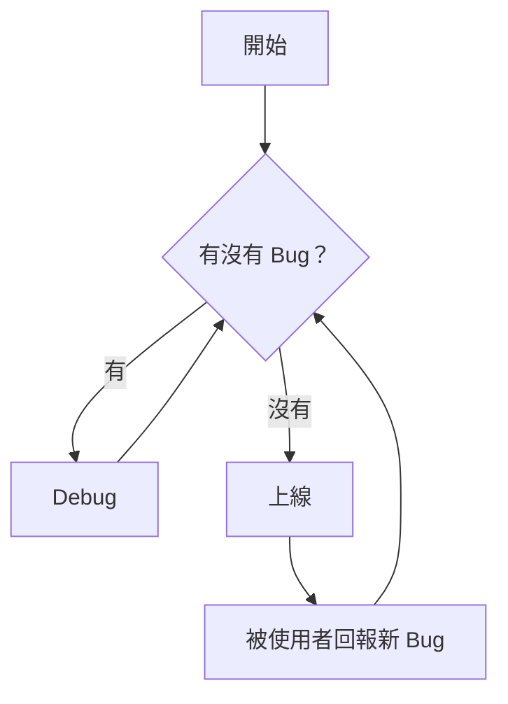
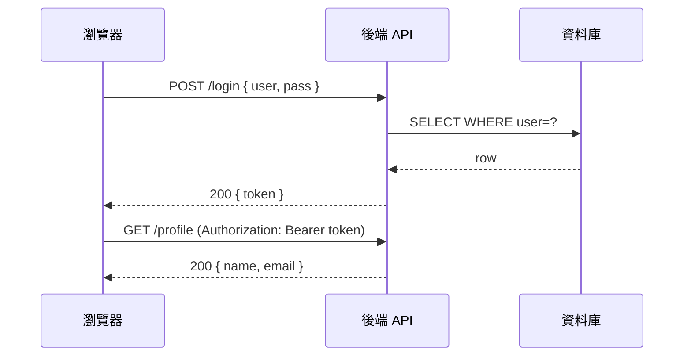
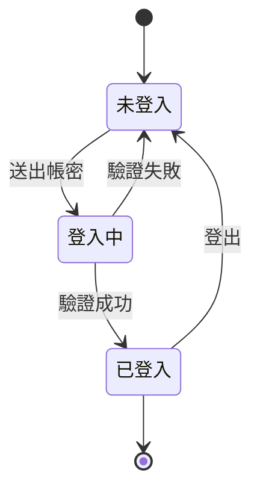
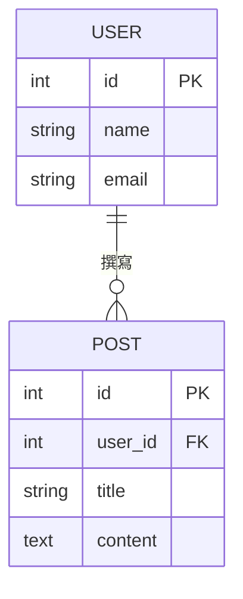
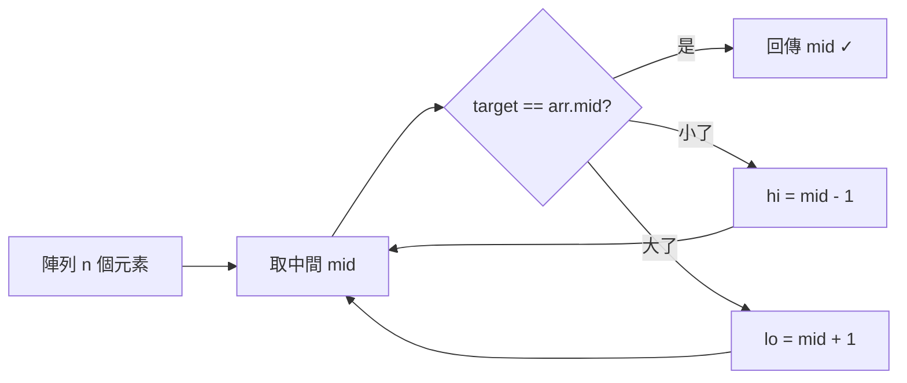

# Mermaid & KaTeX 使用範例

這篇示範你能在 md 文章裡直接使用的所有繪圖與公式語法，不需要任何截圖或圖檔。

---

## 一、Mermaid 流程圖（flowchart）

最常用，適合描述邏輯流程、程式流向。



方向可以改：`LR`（左→右）、`TD`（上→下）、`RL`、`BT`。

---

## 二、Mermaid 時序圖（sequenceDiagram）

適合描述 API 呼叫、前後端互動。



---

## 三、Mermaid 狀態圖（stateDiagram）

適合描述狀態機、UI 狀態切換。



---

## 四、Mermaid ER 圖（erDiagram）

適合描述資料庫結構。



---

## 五、KaTeX 行內公式

在文字中夾入公式，用 `$...$` 包起來：

質能等價：$E = mc^2$，歐拉公式：$e^{i\pi} + 1 = 0$。

二次公式：$x = \dfrac{-b \pm \sqrt{b^2 - 4ac}}{2a}$

---

## 六、KaTeX 區塊公式

單獨一行的大公式，用 `$$...$$` 包起來：

常態分佈的機率密度函數：

$$
f(x) = \frac{1}{\sigma\sqrt{2\pi}} \exp\!\left(-\frac{(x-\mu)^2}{2\sigma^2}\right)
$$

矩陣乘法：

$$
\begin{pmatrix} a & b \\ c & d \end{pmatrix}
\begin{pmatrix} x \\ y \end{pmatrix}
=
\begin{pmatrix} ax + by \\ cx + dy \end{pmatrix}
$$

梯度下降更新規則：

$$
\theta := \theta - \alpha \nabla_\theta J(\theta)
$$

---

## 七、程式碼高亮（原本就有的功能）

```python
def binary_search(arr, target):
    lo, hi = 0, len(arr) - 1
    while lo <= hi:
        mid = (lo + hi) // 2
        if arr[mid] == target:
            return mid
        elif arr[mid] < target:
            lo = mid + 1
        else:
            hi = mid - 1
    return -1
```

---

## 八、混搭使用

在技術文章裡，公式和圖可以搭配文字說明。

例如 Big-O 分析：二分搜尋的時間複雜度是 $O(\log n)$，因為每次把搜尋範圍砍半：

$$
T(n) = T\!\left(\frac{n}{2}\right) + O(1) \implies T(n) = O(\log n)
$$

對應的搜尋流程：


